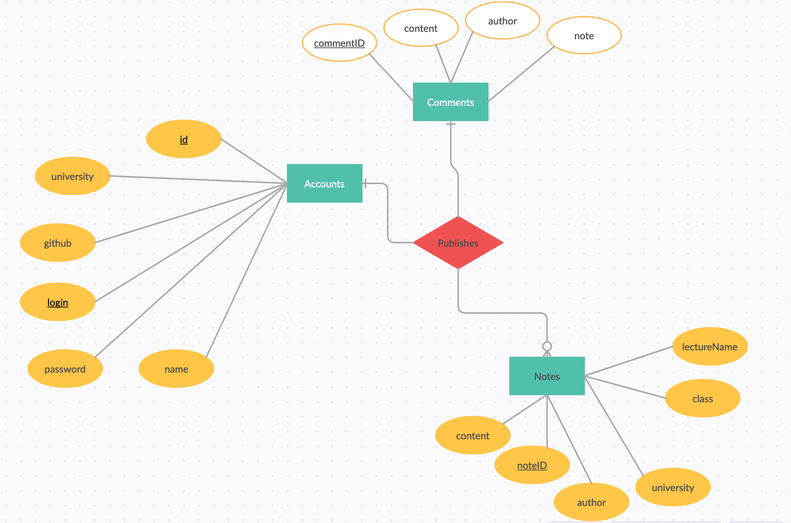
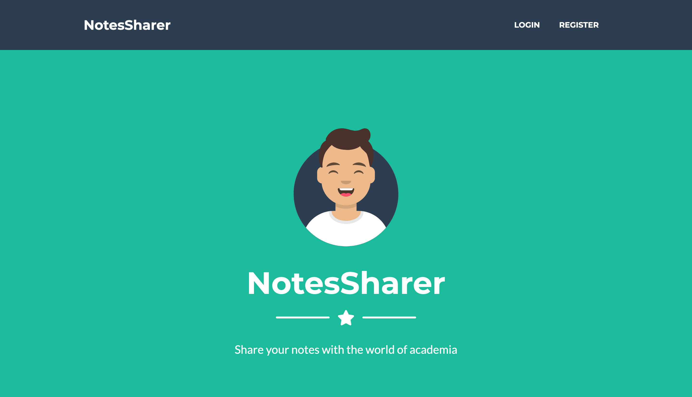
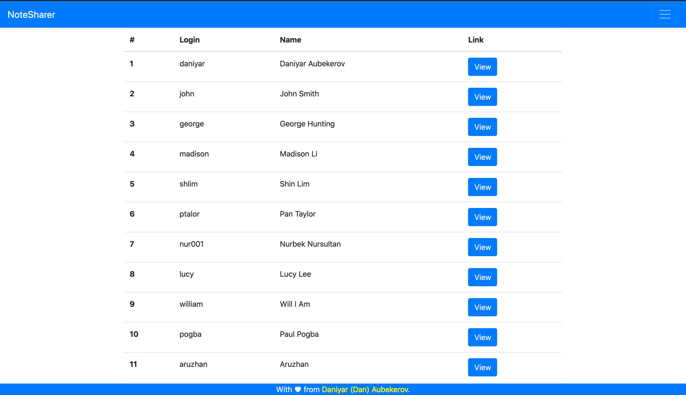
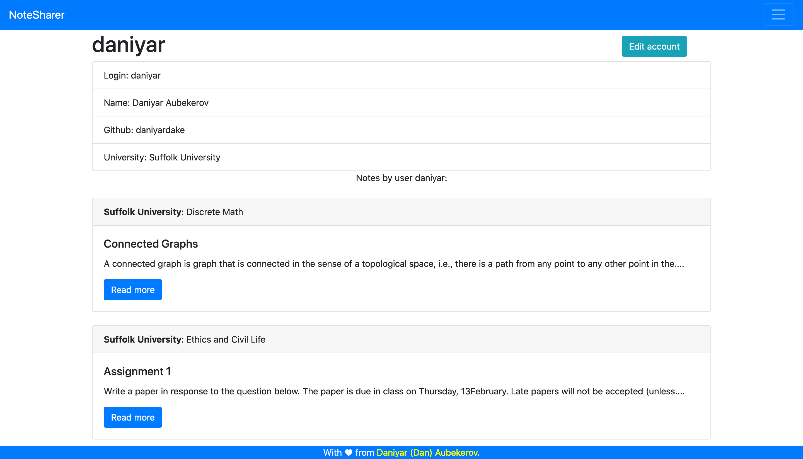
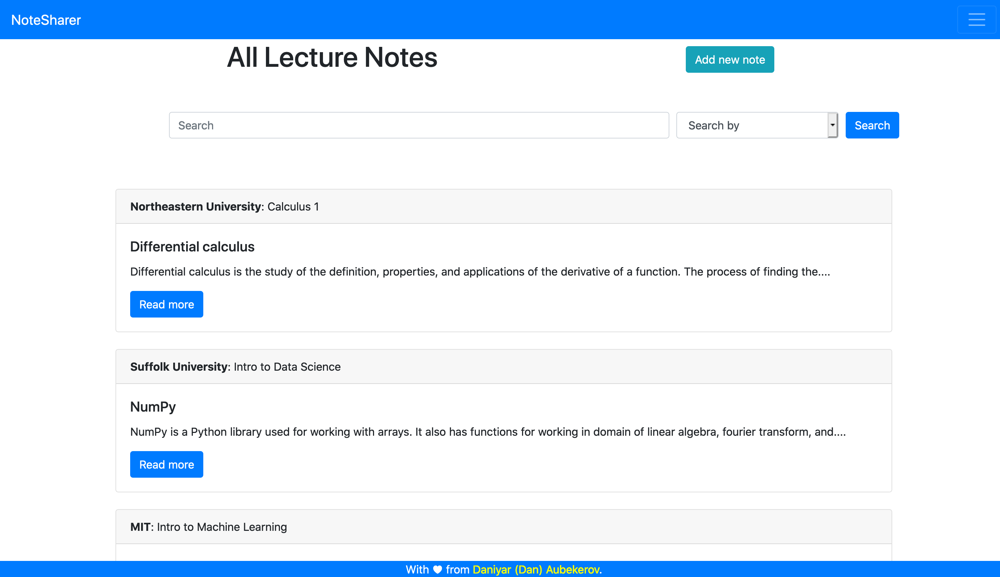
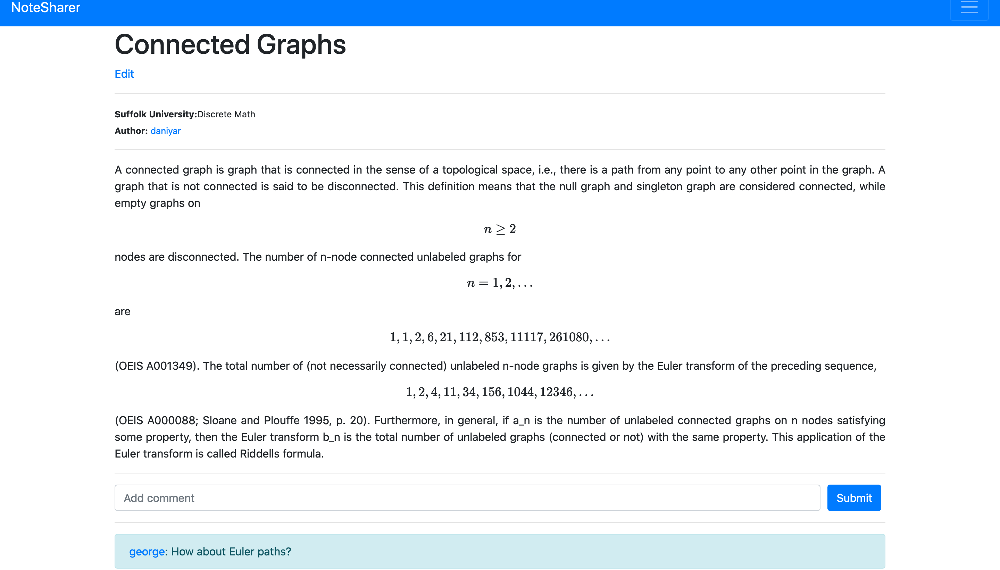

# Lecture Notes Sharer

This is final project of Intro to Database Design Class, where we learned introduction to SQL. For the final project we had to use any programming language and db to create a single application that executes some SQL commands. I decided to use Flask framework. However, as the main purpose was to use SQL commands I did not use SQLAlchemy to handle ORM. In addition, I used JavaScript to do input validation on user's side. Finally, I used MathJax to process LaTeX formulas in Lecture Notes.

The web application has landing page and notes page. After user has registered, he will be able to add lecture notes from his university. There is "All Notes" page, which displays all lecture notes uploaded by the users. In addition, every user can edit their profile, edit notes, and leave comments on notes. There is a "search by" functionality on the "All Notes" page.

## Live view

You can check the live version of the website [here](http://daniyardake.pythonanywhere.com/). Please, create an issue or pull request if it doesn't work.

## Requirements

Use the package manager [pip](https://pip.pypa.io/en/stable/) to install all requirements.

```bash
pip install -r requirements.txt
```

## Usage
 
```bash
python app.py
```

## Sample data

There is an SQL folder, where you can find SQL queries to create sample data. 

- [Accounts Sample Data SQL Queries](https://github.com/daniyardake/NotesSharer/blob/main/sql/accounts.sql)
- [Notes Sample Data SQL Queries](https://github.com/daniyardake/NotesSharer/blob/main/sql/notes.sql)
- [Comments Sample Data SQL Queries](https://github.com/daniyardake/NotesSharer/blob/main/sql/comments.sql)


## ER Diagram



## Screenshots
- Main page

- Users page

- User page

- Notes page

- Note page


## Contributing
Pull requests are welcome. For major changes, please open an issue first to discuss what you would like to change.
Please make sure to update tests as appropriate.

## License
[MIT](https://choosealicense.com/licenses/mit/)
